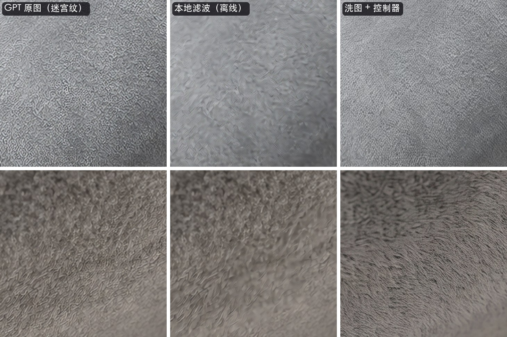

# Repair AI Image Quality

针对 AI 生图常见「顽疾」的修复 Skill（Claude Code / Codex 通用）。核心两项是纯算法、可复现，不重新生图、不改构图；另有两个需要配合图像编辑模型使用的增强流程（见下文「有没有生图 API」）。

| 问题 | 来源 | 表现 | 怎么修 |
|---|---|---|---|
| **迷宫纹 / 蚯蚓纹噪点、放大网格** | GPT image（gpt-image-1 / 2 / 2.5、ChatGPT） | 绒面、毛衣、海绵、皮肤、墙面上布满 4–10 px 的迷宫状细纹，缩小看就是「发脏、颗粒感」；部分平台出 2K 图还带一层固定的 2×2 像素网格 | 先去掉放大网格，再用一个在真实 GPT 迷宫纹上训练的小网络把纹路减掉。只处理检测到迷宫纹的区域，只改亮度；皮肤、头发、边缘、颜色不动 |
| **改图偏洋红 / 色调不一致** | nano-banana（banana-pro、banana-2） | 改图后没改的地方也变得偏粉偏紫、亮度曲线变了，**多轮修改越改越红** | 对齐原图 → 自动找出没改动的区域 → 在那里拟合颜色映射 → 应用到整张改图；你有意改的颜色不会被拉回去 |

## 效果（用真实素材库测得）



**GPT 迷宫纹**：用素材库里 16 张 GPT Image 2.5 出的绒面产品 2K 图实测，全部检测到并处理。取每张图迷宫纹最重的局部，「频谱凸起」中位数从 10.0 降到 **1.4**（旧版频域方法 2.5；≈1 即自然纹理），仍被判成迷宫纹的小块从 56% 降到 0.4%。只处理有迷宫纹的地方（绒面枕头、毛呢外套），每张图改动 9–42% 的画面，人物的脸平均只变 0.01–0.08 个灰阶、毛衣 0.04–0.26，细节保留 98% 以上，颜色零改动，2K 图 2–3 秒。合成测试集（真实迷宫纹叠到干净照片上）PSNR 从 31.3 提高到 **37.9 dB**（旧版 34.1）。非 GPT 图的判定和以前一样：60 张其他来源的图（4000 万像素实拍、Midjourney、banana、书画、游戏美术）中只有 1 张被处理，而它本身就是用 GPT 图排版出的成图。

**banana 偏色**：按「人眼看到的」方式验收。先去掉真正改动的区域，再分肤色、中性灰、绿植、蓝色、暗部、中间调、亮部，比较修正图和底图的局部平均颜色（banana 重画的纹理不算色差）。

- **Higgsfield 对照实验**（GPT 2.5 底图，banana 连续改 3–5 轮，16 张）：每张图里最偏的那一类区域，平均偏差从第一版的 1.88 降到 **0.42**（中位数 0.27）。肤色 a\* 全部落在 −0.02～+0.34。第一版修完会偏绿：人像背景、绿植、聚餐高光 a\* −3.7，新加的灰围巾、白雏菊 −1.6～−2.0。这个问题已经消除，新加的中性色物体现在都在 a\* 0 附近，脸也不再残留洋红。
- **素材库全量**（322 对「原图 → banana 改图」）：83 对校色，其中 82 对改善，未改动区域色差 ΔE00 中位数从 1.29 降到 **0.61**；最偏区域的中位数是 0.15，90% 在 0.49 以内。其余 228 对自动跳过，包括构图不同的重新生成、本来就不偏、原图是白模/灰模，以及整体调色。
- 「换蓝天」「天空调蓝」「加牛羊」这类有意的修改会保留，新换的蓝天不会被拉回灰色。

**多轮累积**（Higgsfield：GPT 2.5 底图，每轮只改一个小地方并要求「其余完全不变」，数值都相对底图）：

| | 第1轮 a\* | 第3轮 | 第5轮 | 第5轮 ΔE00 → 校回底图后 |
|---|---|---|---|---|
| 人像，banana-pro 直接接着改 | +1.37 | +3.64 | **+6.37** | 8.51 → 1.43 |
| 人像，每轮先校回底图再改 | +1.37 | +1.49 | +1.74 | 2.93 → 1.57 |
| 酒吧夜景，banana-pro 直接接着改 | +1.50 | +4.98 | **+8.51** | 7.25 → 1.89 |
| 人像，Banana 2 直接接着改 | +0.86 | +2.63 | +4.23 | 5.46 → 1.46 |
| 6 个人物场景（3 轮） | +0.96～1.63 | +3.07～5.06 | — | 第3轮 4.42～5.94 → 0.95～1.35 |

banana-pro 每轮大约多叠 +1.3～1.8 的 a\*，同时画面略变亮；Banana 2 每轮约 +0.85；白底产品图的背景基本不偏，但产品本身会变紫（第 5 轮绒面产品 a\* +6），现在也能校回。校回后剩下的 ΔE00（约 1–2）是 banana 重画的纹理，不是偏色。另一个真实例子：外景原片换天空后 a\* +1.69，再做一轮 4K 放大累积到 +3.87；如果只校回上一轮，还会残留 +1.60。

结论：**永远以最初的底图为基准**，并且**每轮改完先校色再进下一轮**。

## 安装

```bash
# Claude Code
git clone https://github.com/linsahdkadsa/repair-ai-image-quality.git ~/.claude/skills/repair-ai-image-quality
# Codex
git clone https://github.com/linsahdkadsa/repair-ai-image-quality.git ~/.codex/skills/repair-ai-image-quality
```

需要 Python 3.9+。首次运行会自动在 Skill 目录下建 `runtime/` 并安装 numpy / Pillow / OpenCV（约 30 秒），之后直接复用。

## 用法

装好后直接对 Claude 说「这张 GPT 图噪点太重，帮我去一下」或「这张 banana 改图偏洋红了，对照原图校回来」。也可以手动运行：

```bash
S=~/.claude/skills/repair-ai-image-quality/scripts

# GPT 迷宫纹（自动检测，非 GPT 图会跳过）
$S/run.sh 图1.png 图2.png

# banana 改图校色：--source 必须是最初的底图
$S/run.sh --source 底图.jpg 改图.jpg

# 多轮修改：逐轮报告累积偏色，并把每一轮都校回底图
$S/run.sh --source 底图.jpg --chain 第1轮.jpg 第2轮.jpg 第3轮.jpg

# 回贴：只保留改动区域，其余像素与底图逐像素一致（按底图分辨率输出）
$S/run.sh --source 底图.jpg 改图.jpg --paste-back
```

Windows 把 `run.sh` 换成 `powershell -ExecutionPolicy Bypass -File run.ps1`。

结果默认放在原图旁的 `repaired/` 文件夹，每张图包括：
- `xxx_fixed.png`（或 `.jpg`）：修复后的图
- `xxx_fixed.json`：完整指标
- `xxx_fixed_compare.png`：原图、改图、修复后三栏，加 200% 局部放大

常用参数：

| 参数 | 作用 |
|---|---|
| `--strength 0-100` | 迷宫纹去除强度，默认 60（检测到的迷宫纹全部去掉）；30 只去一半，保留更多原始纹理；80–100 把迷宫纹较稀的地方也一起处理 |
| `--color-strength 0-100` | 校色力度，默认 100 |
| `--keep-new-colors` | 只在改动区域出现的新颜色保持 banana 原样（默认也会去掉整体偏色，保证全图一致） |
| `--ignore-mask mask.png` | 白色 = 有意改色的区域，不参与拟合 |
| `--force-color` | 未改动区域和原图差得远超 banana 偏色（像有意的整体调色）时，默认不校；确认只是偏色再加这个 |
| `--no-demaze` / `--no-color` | 只做其中一项 |
| `--model gpt` | 确认是 GPT 图（比如被放大过）时强制走去迷宫纹 |

## 增强流程（需要图像编辑模型配合）

**迷宫纹「洗图 + 融合」**：本地滤波去得干净但绒面会偏平。更好的做法是让图像编辑模型（如 Nano Banana 2）把面料重画一遍，再由控制器只取它的细纹理、颜色和结构仍用原图：

```bash
$S/run.sh controller plan 图1.png 图2.png        # 找出要洗的图，生成提示词 repaired/plan.json
# 用任意图像编辑工具按提示词重画这些图，放进一个文件夹
$S/run.sh controller run 图1.png 图2.png --washed 洗过的文件夹
```

洗图和原图结构一致就融合；改动太多会整张用洗图并校回原图颜色，标记「请人工确认」。

**产品细节移植（实验性，不稳定）**：模型会把条纹画成平行等宽、多画一条，或者把 logo 字母重排，提示词和参考图都压不住。办法是用同一侧的产品实拍图，按鞋身等固定结构上的对应点把部件「搬」过来，再让模型只统一光影一次，最后自动检查部件有没有被挪动：

```bash
$S/run.sh transplant grid 场景图.jpg --out 网格.png        # 读对应点用
$S/run.sh transplant prep --scene 场景图.jpg --product 产品图.jpg --pairs "..." --part "..." --out 移植
# 用图像编辑模型对 移植/transplant.jpg 整图跑一次「均匀化」提示词，出 3–4 张
$S/run.sh transplant finish --dir 移植 --candidates 候选1.jpg 候选2.jpg
```

目前只在少量样本上验证过，效果不稳定：logo 字乱这类问题修好过，但条纹的弧度、宽度、锯齿边、缝线、材质光泽等仍经常和产品对不上，「均匀化」那一步也可能把细节柔化或挪位。请把它当作辅助工具，交付前务必和产品图整只并排比对。

## 有没有生图 API？

| 功能 | 只要 Python（离线） | 需要图像编辑模型 |
|---|---|---|
| GPT 迷宫纹（本地滤波） | ✅ | |
| banana 偏色校回底图 | ✅ | |
| 迷宫纹「洗图 + 融合」 | 融合、校色、验收在本地 | 洗图那一步 |
| 产品细节移植（实验性） | 对位、移植、检查、校色在本地 | 「均匀化」那一步 |

Skill 本身不调用任何生图服务，也不需要 API Key。在 Claude Code / Codex 里，如果接了生图工具（MCP 或 API），代理会自动完成洗图那一步；没接的话，`plan` 会给出要处理的图和提示词，你在任何工具（Gemini、ChatGPT、其他聚合平台）里生成好放进文件夹，再执行 `run` / `finish` 即可。

## 原理简述

- **迷宫纹**：先在 32×32 重叠小块上分析亮度频谱，找出 GPT 迷宫纹（0.25–0.47 倍奈奎斯特频率处凸起、0.56 以上断崖、各向同性），再把这些小块连成区域，免得区域里漏判的小块留下一块块脏斑。区域内用一个小 U-Net 预测迷宫纹并减掉：约 47 万参数，1.9 MB，OpenCV 直接运行，不用额外安装。训练数据是从真实 GPT 图里提取的迷宫纹，叠到干净照片上；另外加了皮肤、头发、针织等真实纹理，让它学会哪些该保留。文献里处理这类「有色噪声」最强的经典方法是 BM3D 的相关噪声版本，但官方实现只许非商业使用。按同一思路自己实现的分块 DCT 维纳滤波，在真实迷宫纹上只有 30.5–34.8 dB，因为迷宫纹的强度随亮度变化，又和真实纹理挤在同一频段。模型跑不了时会自动退回旧的频域方法。详见 [references/gpt-maze-noise.md](references/gpt-maze-noise.md)，重新训练见 [training/README.md](training/README.md)。
- **偏色**：ECC 对齐（构图有变化时用特征点对齐）。然后分两级找「没改动」的区域：一级是像素级结构一致；另一级专门处理 banana 重画了纹理但颜色本该不变的地方（脸、头发、针织、丝绒、草木），比较模糊后的局部平均颜色。拟合用每通道单调色调曲线，加 3D LUT，再加低频空间场，用交叉验证选级别，能分别校正不同颜色的偏移：肤色比灰墙偏得多，绿色偏得少，蓝色会更蓝。和 banana 偏色方向不一致的成片区域视为有意修改并剔除，比如把灰天空换成蓝天，包括它淡淡的边缘。拟合时没见过的颜色只去掉同亮度、同类（中性或有色）区域的偏色，不做外推。banana 新加的物体，比如围巾、白杯、雏菊，在接近中性的通道上只校到中性为止，不会越过去变绿。原图是白模/灰模，或者差异远超 banana 偏色时，会自动跳过并说明原因。详见 [references/banana-color-drift.md](references/banana-color-drift.md)。
- 多轮修改的推荐流程见 [references/multi-round-workflow.md](references/multi-round-workflow.md)。

## 局限

- 去迷宫纹只针对 GPT 的特征，不是通用降噪；JPEG 块、胶片颗粒、MJ 颗粒不处理。带相机 EXIF 或长边 > 3200px 的图默认视为实拍并跳过。生成后又被放大 2 倍的 GPT 图，迷宫纹也跟着变大，检测不到，请用原尺寸文件。
- 校色需要带真实颜色的原图（白模、灰模、线稿不行），且至少约 10% 的区域没被改。如果改图本身就是全局调色（改黄昏、改暖调），请跳过校色或用 `--ignore-mask`。
- 本地修复不改结构、不重绘；产品细节移植需要同侧的产品实拍图，弧度很大的部位（鞋头）或机位差很多时对不准。人脸、自由文字不在范围内。

## 自检

```bash
$S/run.sh selftest   # 合成数据回归测试（15 项，含「用新模型去迷宫纹」「模型跑不了时退回频域方法」「多色偏移修完不偏绿」「白模原图跳过」「产品部件移植位置准确、被挪动的候选会被拒」），约 30 秒，全部 PASS 才算正常
```

## License

[MIT](LICENSE)
